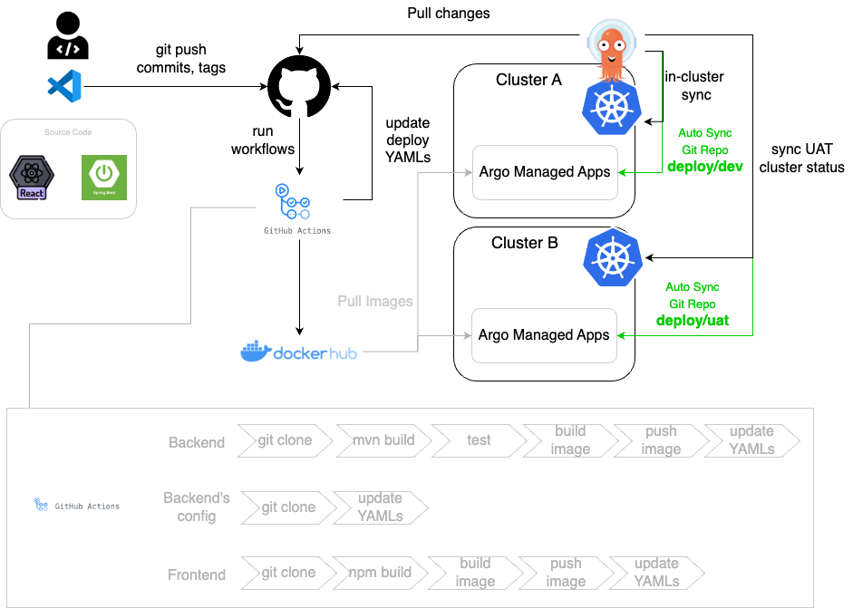

# 4. [主線]建立前後端分離專案敏捷開發流水線

## Lab整體流程架構圖

## 主線任務

[1. Fork Github Repository ](doc/1.md)

[2. Github Repository配置](doc/2.md)

[3. Local開發環境設置](doc/3.md)

[4.首次進行部署與驗證](doc/4.md)

[5. 進行修改讓流水線自動部署吧](doc/5.md)

## 疑難雜症處理(Git相關)

[配置Github SSH Key一勞永逸](doc/6.md)

[Windows git clone操作步驟 ](doc/10.md)

[Windows git Push失敗處理方式](doc/9.md)

[Mac git clone操作步驟 ](doc/8.md)

[Mac git Push失敗處理方式](doc/7.md)