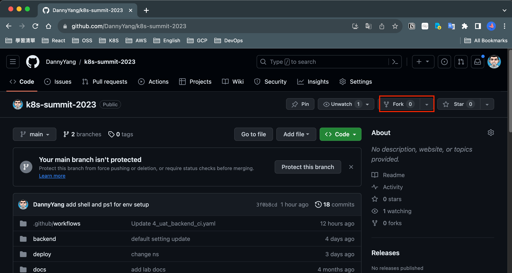
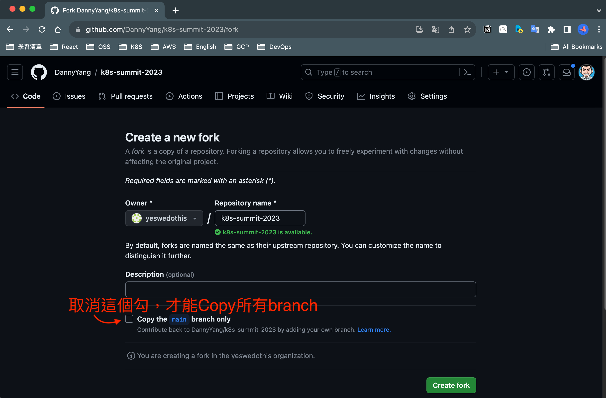
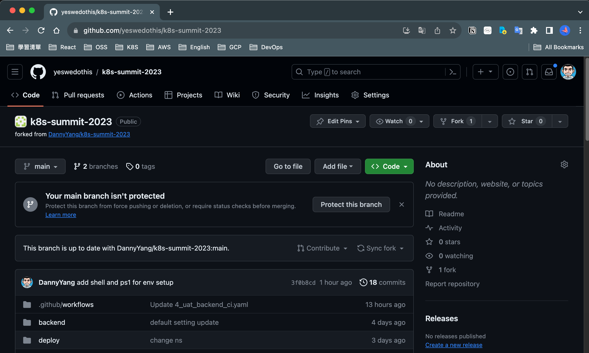
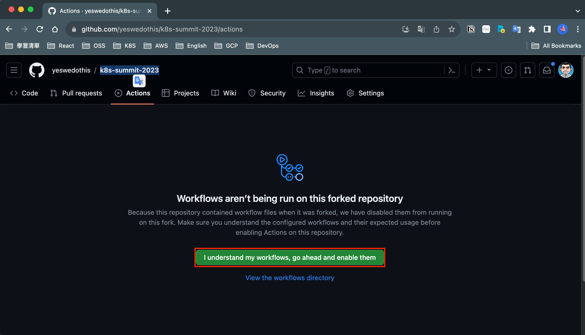
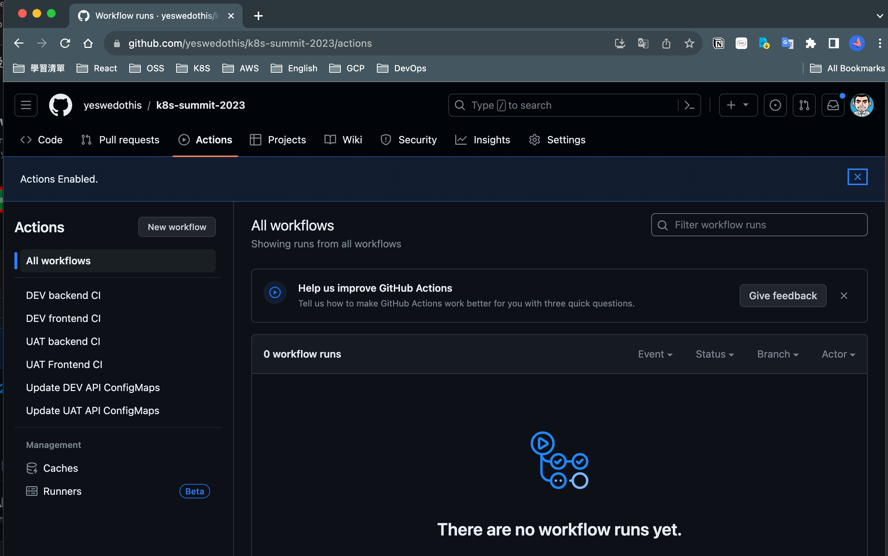

# 1. Fork Github Repository

<aside>
💡 請注意，記得要Copy到所有branch，請仔細看步驟2的圖片

</aside>

(1) 首先，請先進Workshop repository，點擊「fork 」
[https://github.com/DannyYang/k8s-summit-2023](https://github.com/DannyYang/k8s-summit-2023)

(2) **＃重要＃**請確保這個勾勾關掉(因為我們要copy所有branch)，再按下Create fork

(3) 完成專案fork

(4) 啟動Github Action配置  (預設是關閉的)

(5) Github Action啟動完成

