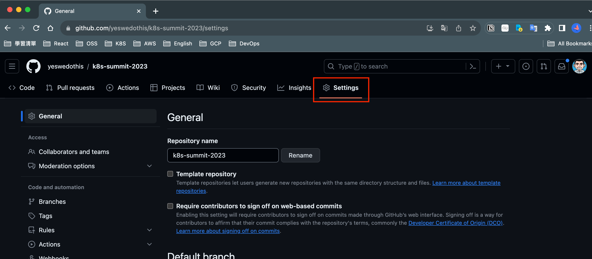
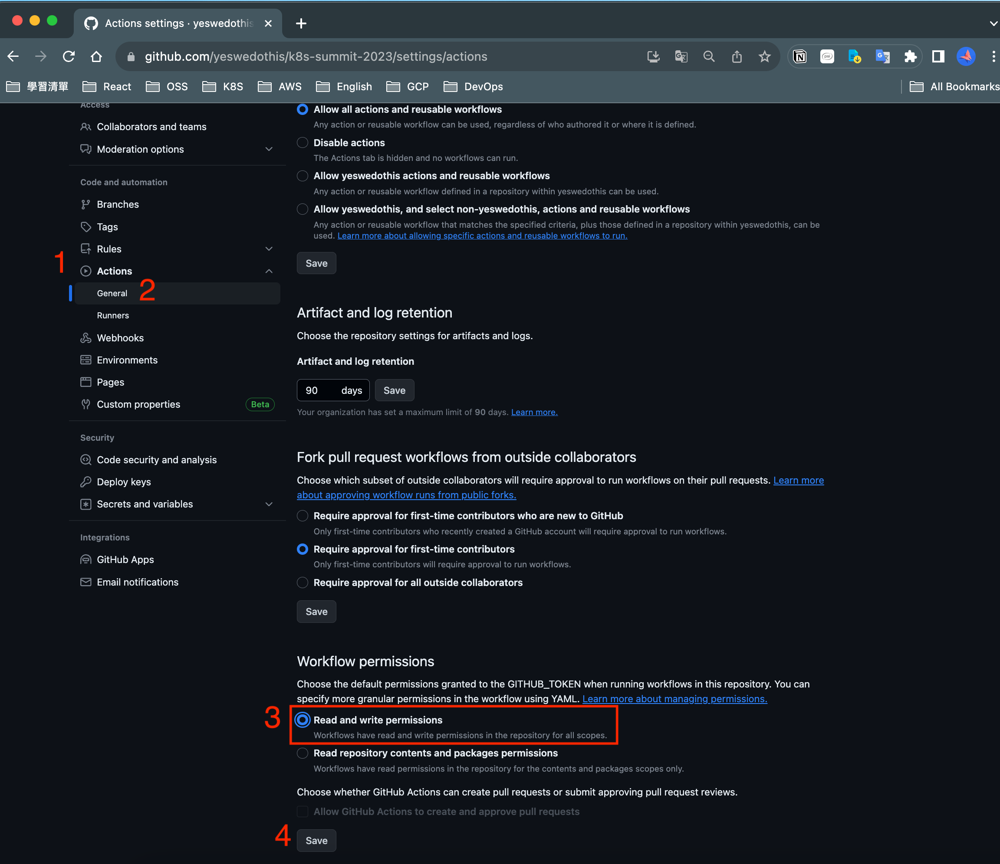

# 2. Github Repository配置

<aside>
💡 這部分是為了給Github Action 使用，需要配置Secret，共需要配置2個，分別是

| DOCKERHUB_USERNAME | 個人的Docker Hub 帳號  |
| --- | --- |
| DOCKERHUB_PASSWORD | 個人的Docker Hub 密碼 |

此外，還需要配置預設的GITHUB_TOKEN寫入權限

</aside>

### 2-1 設定Repository Secrets

(1)回到剛剛Fork下來的專案，點擊Settings

(2)點擊 Settings

(3)展開Secrets and variables，點擊Actions後，點擊New repository secrets 來產生2個secrets

分別產生2個secrets，如下圖所示

| DOCKERHUB_USERNAME | 個人的Docker Hub 帳號 |
| --- | --- |
| DOCKERHUB_PASSWORD | 個人的Docker Hub 密碼 |

DOCKERHUB_USERNAME

DOCKERHUB_PASSWORD

設定完成後，結果如下

(4) 配置GITHUB_TOKEN有寫入權限

展開Actions後，點擊General，在下方的**Workflow permissions 點擊「Read and write permissions」勾選後，記得點擊Save保存**

Github Repository配置完成