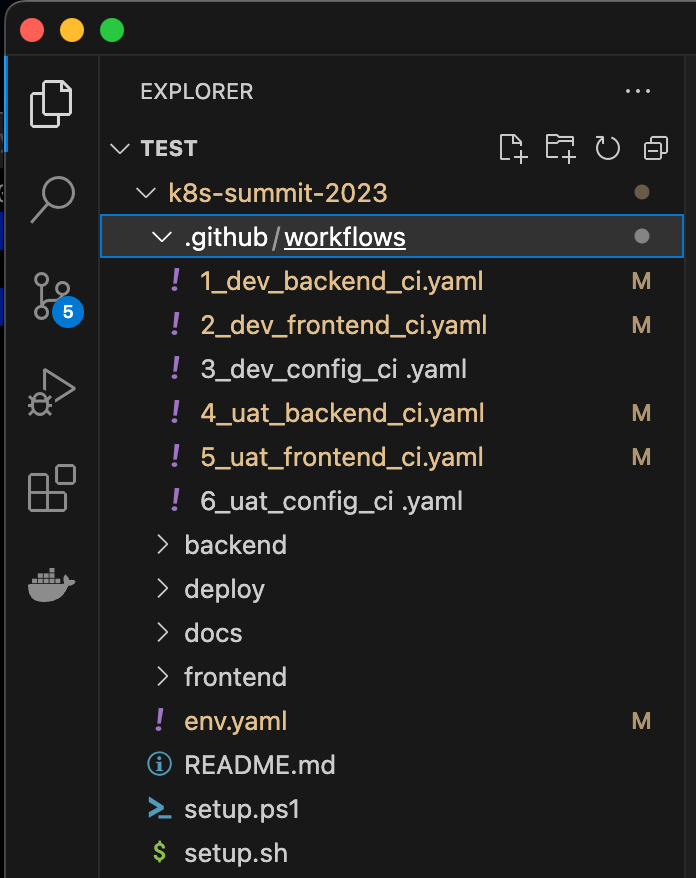

# 3. Local開發環境設置

<aside>
💡 這章節主要會做兩件事
第一部分： 配置VS Code 
第二部分：專案初始化，透過提供的shell or Powershell

如果你很熟git指令操作，第一部分可以省略，請直接Git clone下來後，開啟VScode跳到步驟(9)

</aside>

(1)開啟VScode 

如果你是Windows步驟(1) ~ (8) 請慘考這篇

[Windows git clone操作步驟](https://www.notion.so/Windows-git-clone-c67c66a6cd99438eac819e5ddf260e80?pvs=21)


(2)點擊允許登入


(3) 點擊Authorize Visual-Studio-Code


(4)點擊開啟Visual Studio Code.app


(5)點擊開啟


(6)在上方視窗會顯示這個Github帳號底下所有的Repository，點選剛剛Fork的專案


(7)選擇Clone專案的存放位置(自訂可任意)，選好後點擊「選擇儲存庫位置」


(8)完成專案Clone與本地配置


(9)輸入cmd + J 喚起終端機(Mac). Windows ctrl + J


接下來的Workshop 大部分的git操作，都會在此進行，請先確保環境都Ready

(10)請修改env.yaml檔案中的兩個部分

| dockerAccount | 請填入個人的docker帳號名稱 |
| --- | --- |
| os | 如果你是m1 m2晶片，請將這裡改成arm，如果不是預設amd就可以了 |

(11) 更改完成後，請存擋


(12) 接著請執行提供的shell / power shell 執行檔案
Mac執行 ./setup.sh

Windows 則執行 ./setup.ps1

執行後，應該會如下圖所示，共有4個Github Action pipeline被修改



<aside>
💡 若執行時出現權限不足時(permission denied)，請先執行
chmod +x setup.sh
開啟權限後，在執行一次./setup.sh

</aside>

(13)配置完成後，先git commit & push到Github，依序執行

```bash
git add .
git commit -m 'project config complete'
git push
```

如下圖所示


完成專案初始化配置