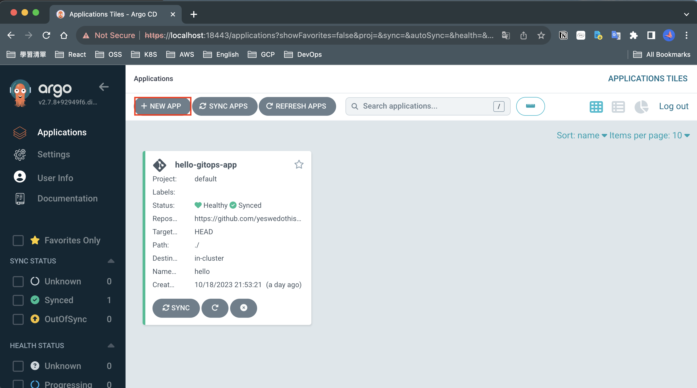
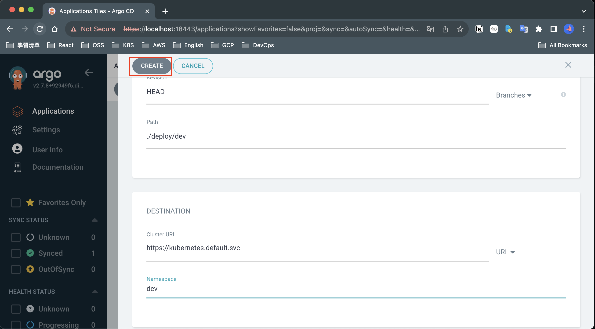
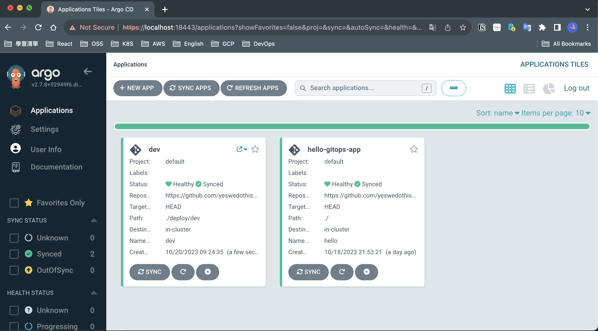
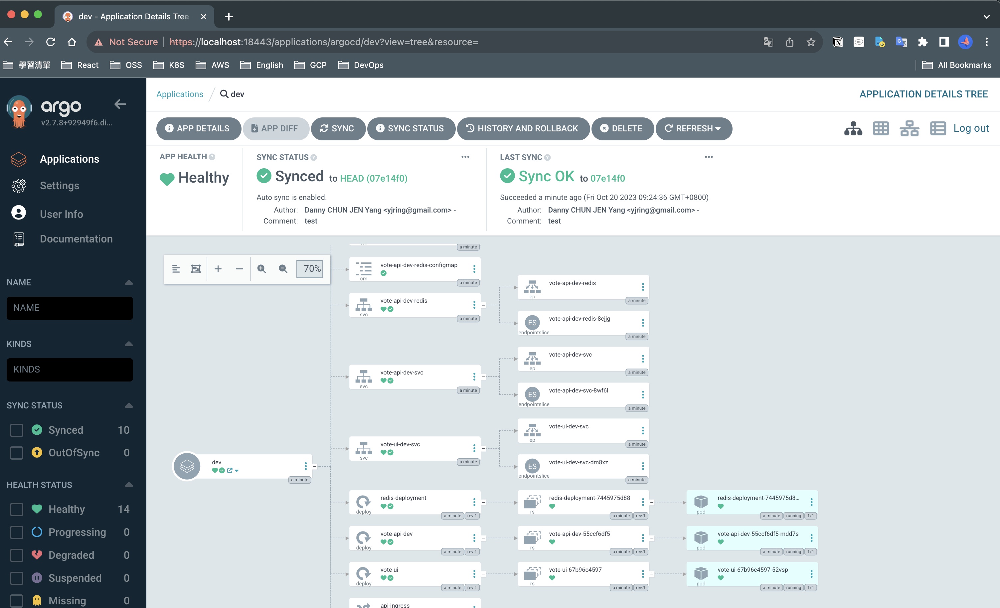
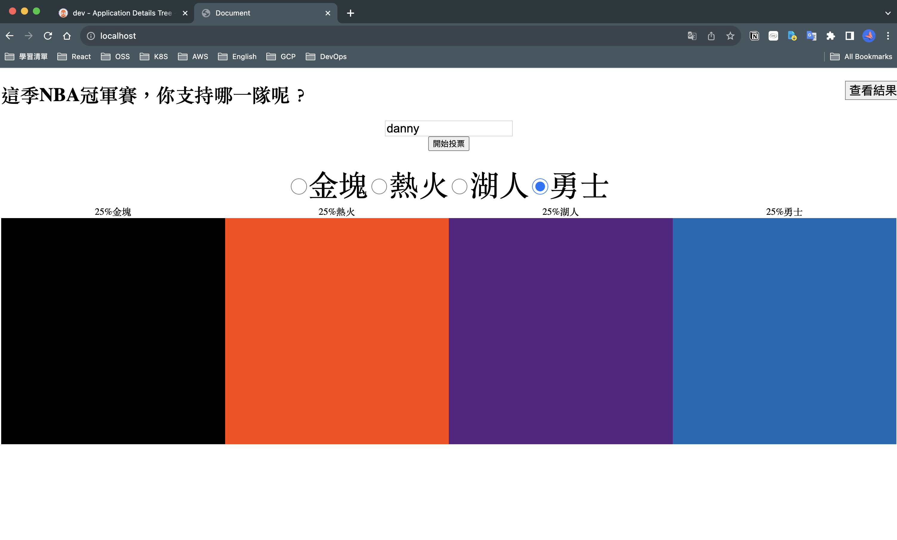
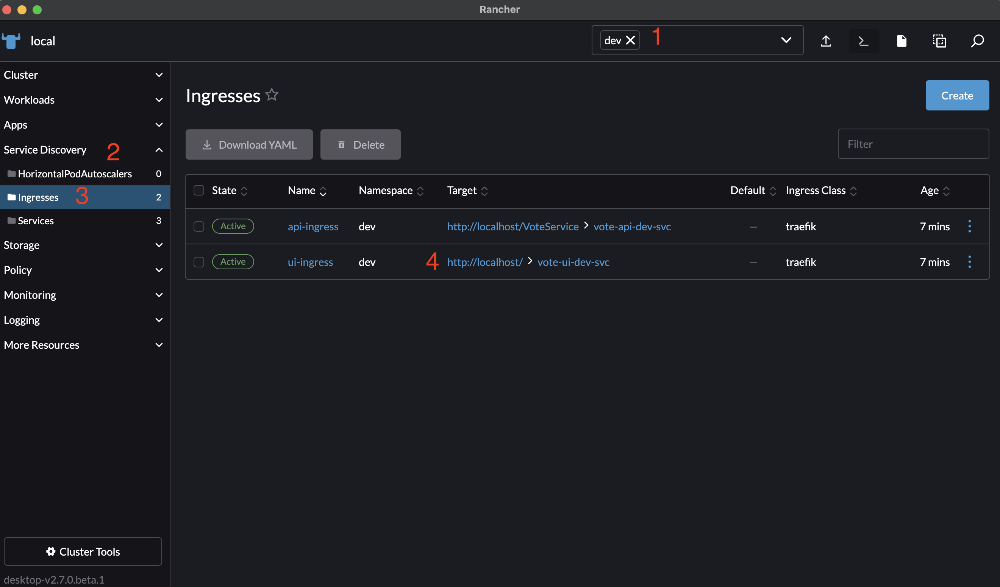

# 4.首次進行部署與驗證

<aside>
💡 接下來將會正式部署到本地叢集上，過程中會有三次迭代，分別是(1)更改設定 (2)更改後端程式碼，(3)更改前端程式碼，過程中會觸發不同GIthub Action pipeline

</aside>

(1)回到ArgoCD管理畫面，新增應用程式

(2) 依序填入下方資訊

| 欄位 | 輸入 |
| --- | --- |
| Application Name | dev |
| Project Name | default (用選的) |
| SYNC POLICY | Automatic (用選的) |
| AUTO-CREATE NAMESPACE | V (打勾，Argo會幫你自動建立namespace)  |
| Repository URL | (剛剛Fork後，你的GitHub Repo URL) |
| Path | ./deploy/dev |
| Cluster URL | https://kubernetes.default.svc/  (用選的) |
| Namespace | dev |

全部填寫完成後，按下

等待部署完成

點擊dev，進去看整個拓墣

(3)打開瀏覽器，查看本地部署結果

[http://localhost](http://localhost/)

[支線]你也可以透過Rancher找到部署的Ingress所提供的連結打開網頁，步驟如下圖

