# 5. 進行修改讓流水線自動部署吧

(1)首先進入剛剛部署的頁面，開始輸入Name來開始投票(請任意操作投票)


咦！你發現金塊隊伍的顏色好像有問題，怎麼會是黑色呢，於是趕緊修改配置，緊急調整上版

(2)於你打開VS Code，找到後端JAVA程式碼的配置檔案，進行調色

(檔案路徑 backend/resources/application.yml)

請將金塊的bgColor從#000000改為#FFD700

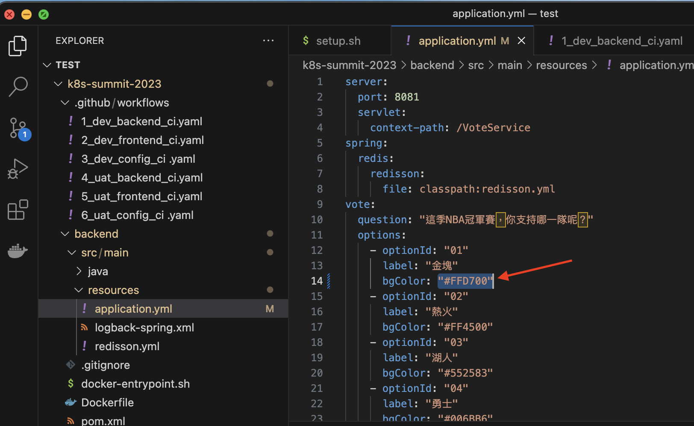

(4) 編輯完成後存檔，並且git commit & push，交給pipeline更新部署吧

```bash
git add .
git commit -m 'Modified bgColor'
git push
```

操作結果如下

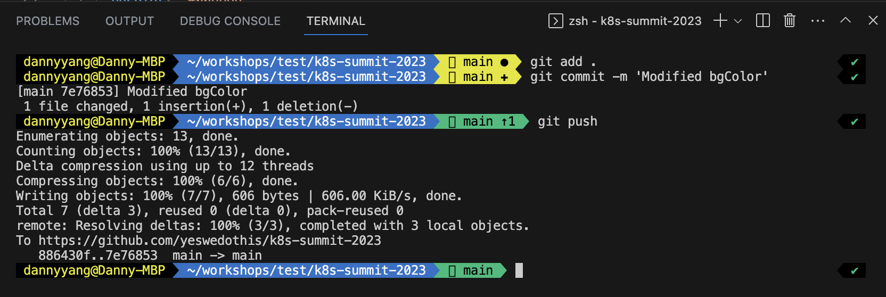

這時候你可以看到Github Actions正在偷偷跑


我們配置的ArgoCD也偷偷Auto Sync部署好了

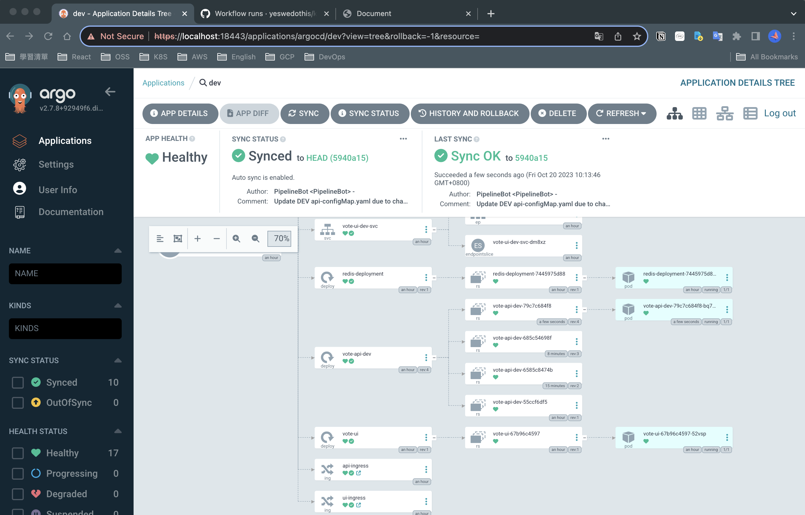

(5) 刷新原本的頁面看看成效

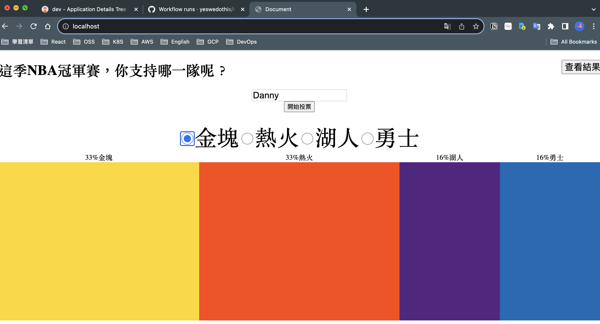

呼，鬆口氣，終於可以交測惹

(6) 沒想到QA Team這時傳訊息給你，一個堂堂投票系統，竟然可以重複投票，太荒誕了，請立刻修改！

於是團隊修改後，並且push到另一個feature branch 上，你準備將後端程式碼併入到main branch

輸入以下git 指令來更新最新的後端程式碼

在開始之前，請隨時記得先git pull 拉一下最新的檔案，以減少衝突merge事宜

```bash
git pull
git cherry-pick d79f5cd
```

執行結果如下圖所示

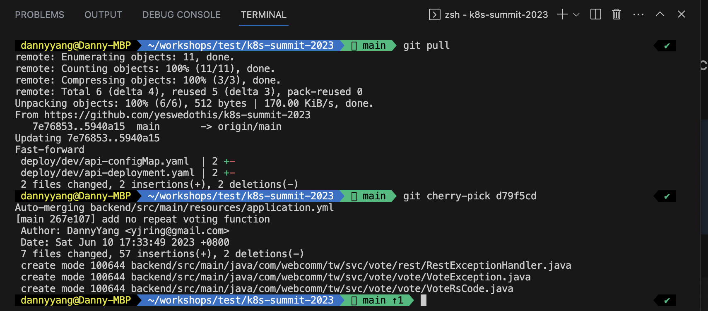

你可以看到Backend有3個新增檔案，以及修改的地方，接下來，進行git push 來觸發DEV的部署，來看看結果是否為滿足QA Team的驗證

```bash
git push
```

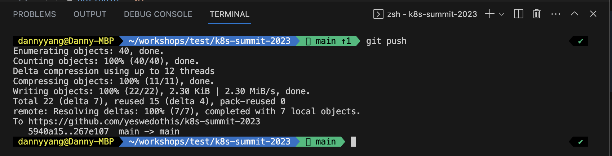

(7) 觀察Github Action是否有成功跑起來

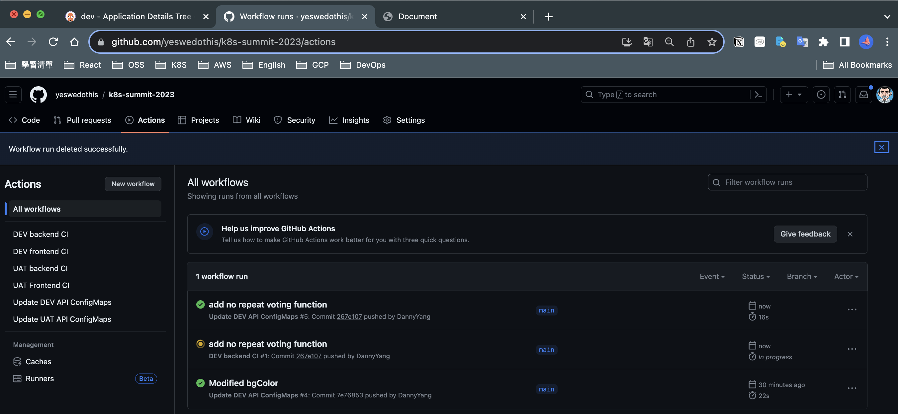

觀察：你可以觀察到，這兩個pipeline觸發條件是有特定路徑的偵測

一個是backend的程式碼


另一個是設定檔案


等待pipeline執行完後更新Yaml後，ArgoCD將會自動更新部署

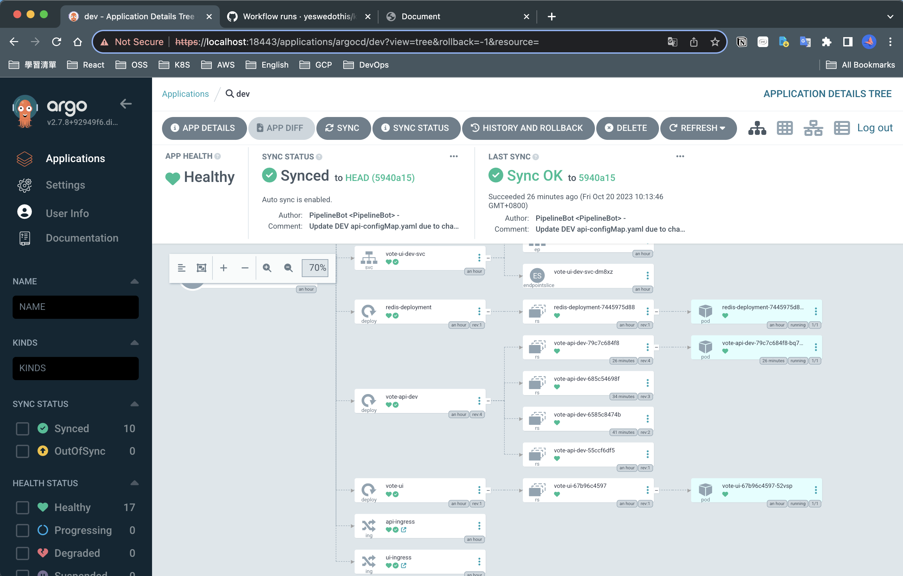

(8)驗證更新後的結果

你會發現一旦投票後就無法切換到其他選項了，成功部署上去了！

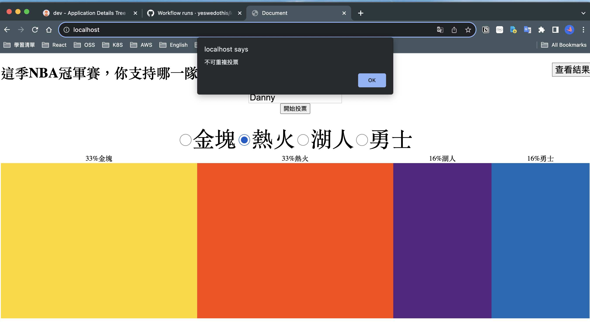

於是你快樂的交差給QA Team

(9)沒過一會，QA Team發現你的UI介面跟規格不同，不給過退回給團隊，你只好請前端團隊，進行UI體驗優化，一段時間後，你得知他們的Code已經Ready了，於是你輸入以下git取的最新程式碼

```bash
git pull
git cherry-pick c05c9bd
```

檢查一下差異後，你覺得OK沒問題，直接上版

```bash
git push
```

等待UI部分打包完成

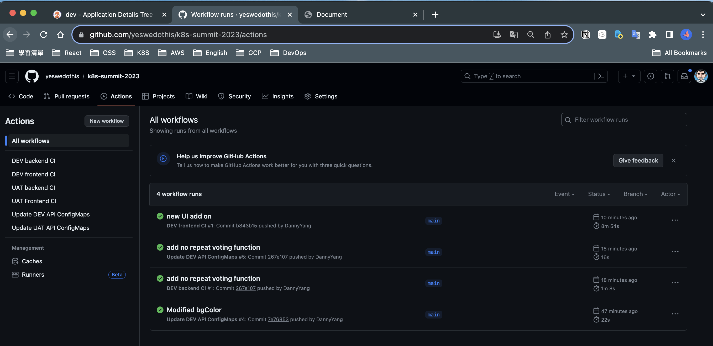

觀察：這次只有UI pipeline正在執行

(10)刷新DEV環境的網頁驗證看看吧

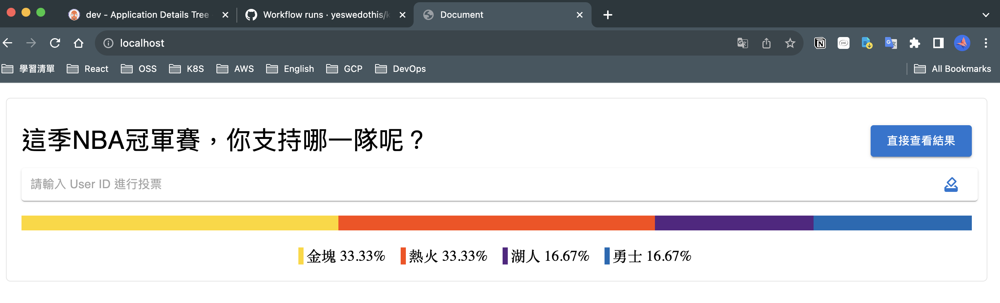

完美達成本次sprint目標